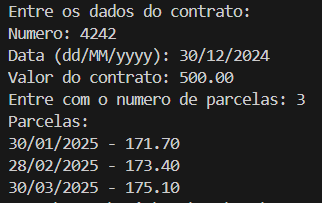

# Contract Payment Processor

Este projeto é uma aplicação Java para processar contratos com base em pagamentos parcelados. Ele permite calcular as parcelas de um contrato usando um serviço de pagamento configurável, como o PayPal.

## 📋 Funcionalidades

- Entrada de dados do contrato, incluindo número, data e valor total.
- Configuração do número de parcelas para o pagamento.
- Processamento e exibição das parcelas calculadas com juros aplicados.

## 🛠️ Tecnologias Utilizadas

- **Java**: Linguagem de programação principal.
- **Java.time**: Para manipulação de datas.
- **POO (Programação Orientada a Objetos)**: Estrutura de classes para organizar as entidades e serviços.
- **Integração com serviços de pagamento**: Serviço PayPal configurado como exemplo.

## 📂 Estrutura do Projeto

O projeto está dividido em pacotes para melhor organização:

- `entities`: Contém as classes principais do modelo de domínio, como `Contract` e `Installment`.
- `services`: Contém os serviços de processamento e lógica de negócios, como `ContractService` e `PaypalService`.
- `application`: Contém o ponto de entrada do programa (`App`).

### Exemplo Visual
Abaixo está uma captura de tela do resultado gerado pela aplicação:

